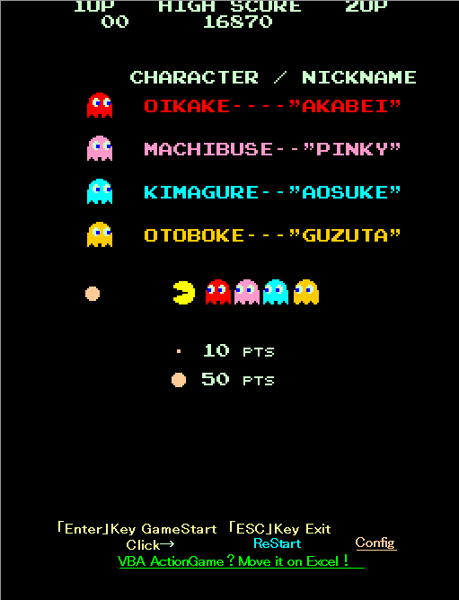
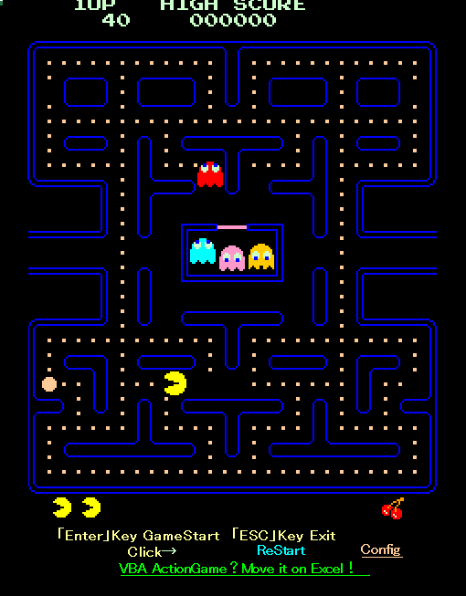
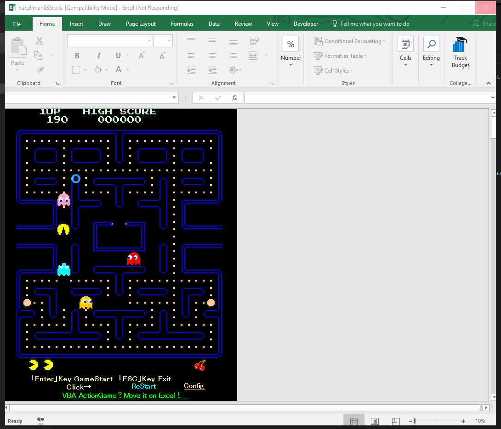
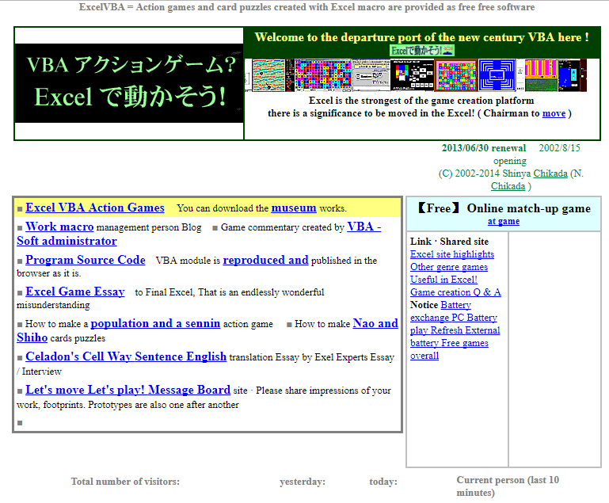
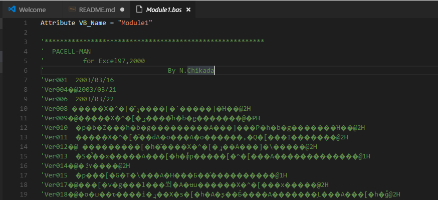

## Pac-Man, in Excel!

I have unpacked this with my [VBA-IDE-Code-Export](https://github.com/spences10/VBA-IDE-Code-Export) tool, if you want to have the binary go to the releases and download it from [there](https://github.com/spences10/pacellman/releases/tag/1.0.0).

This was made in Microsoft Excel 2003, an awesome achievement!

There is a link to what appears to be called [VBA Action game](http://www1.plala.or.jp/chikada/index.htm)

Heres a pic of the site:

Thanks to [Nathan Piercy](https://twitter.com/nathanprocks) for confirming the author as 'Nobuya Chikada' links for this can be found [here](http://web.archive.org/web/20100505141436/http://www.geocities.jp:80/nchikada/pac/index.htm) detailing his name, it's also quite clearly marked in `Module1.bas`! screenshots here:

![](img/confirmaition.png

~~As the only reference I have to the origin of this code is to the site linked and the owner of that site 'Nobuya Chikada' therefore I see fit that this name should be what is added to the license unless I'm otherwise instructed by the source owner to do so.~~

~~I lay no claim to this, I have found this on an old external hard drive from an old job back in 2007, this is not my content if you are the owner and you do not want this being shared then I will respect your wishes~~

Thank you [not now so] mysterious contributor from the past :+1: **Nobuya Chikada**
