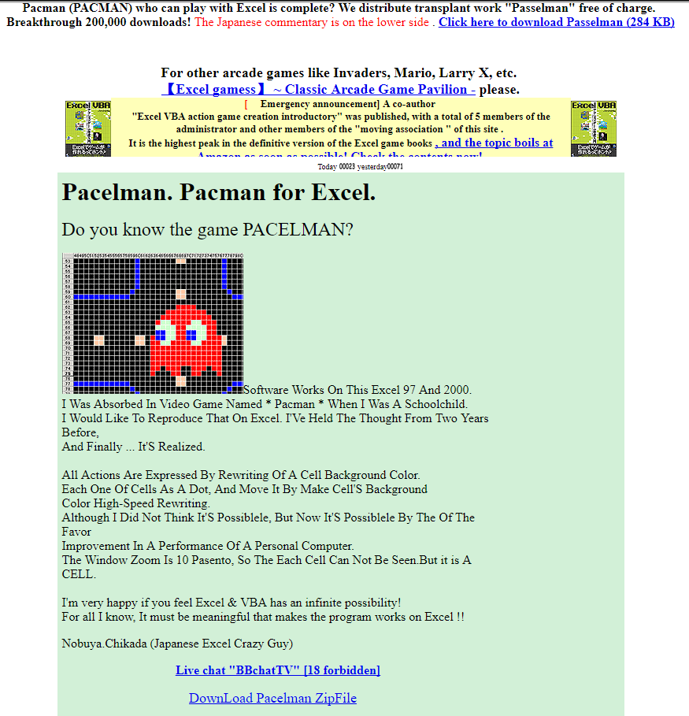
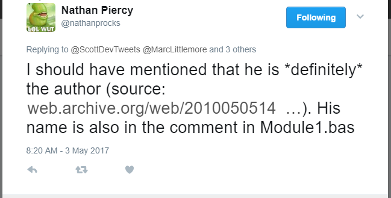
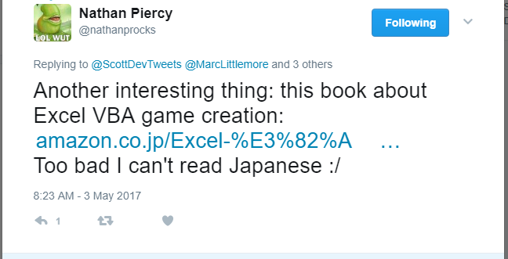

## Pac-Man, in Excel!

I have unpacked this with my [VBA-IDE-Code-Export](https://github.com/spences10/VBA-IDE-Code-Export) tool, if you want to have the binary go to the releases and download it from [there](https://github.com/spences10/pacellman/releases/tag/1.0.0).

This was made in Microsoft Excel 2003, an awesome achievement!

There is a link to the site [VBA Action game](http://www1.plala.or.jp/chikada/index.htm)

Heres a pic of the site:

Thanks to [Nathan Piercy](https://twitter.com/nathanprocks) for confirming the author as 'Nobuya Chikada' links for this can be found [here](http://web.archive.org/web/20100505141436/http://www.geocities.jp:80/nchikada/pac/index.htm) detailing his name, it's also quite clearly marked in `Module1.bas`! screenshots here:

This looks like a great resource if you want more retro games, also Nathan linked a book for VBA Game creation, looks to be a bargain @~£76 :+1:

Thank you [not now so] mysterious contributor from the past :+1: **Nobuya Chikada**
